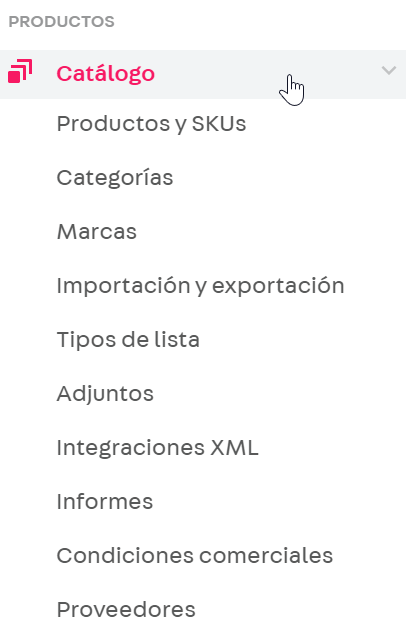

# Catálogo

Catálogo es uno de los módulos de administración de su tienda. Esta área permite configurar las funcionalidades referentes a la variedad de productos de su e-commerce.

## **Productos y SKU**

En esta pestaña, se puede añadir nuevos productos y SKUs a su tienda. Es el área donde usted ingresa informaciones de lo que está disponible en su tienda, como nombre del producto, descripción e imágenes.

## **Categorías**

Esta parte posibilita crear secciones que faciliten la búsqueda de los productos ofrecidos en su tienda. Para esto, es importante definir el árbol de categorías de su e-commerce al inicio del proyecto. Usted podrá organizar sus ítems creando categorías que simplifiquen la identificación de los productos por sector. En esta sección, usted organizará las categorías de los productos de acuerdo con la taxonomía de su tienda.

## **Marcas**

Aquí usted va a registrar las marcas de los productos que existen en su tienda, agrupando los ítems. De esta manera, sus clientes también pueden encontrar lo que buscan de forma más específica.

## **Importación y exportación**

Aquí es posible importar o exportar productos por plantilla. En lugar de añadir productos/SKUs uno por uno, puede crear o editar una gran cantidad a la vez. También es posible importar/exportar especificaciones del producto/SKU e imágenes.

